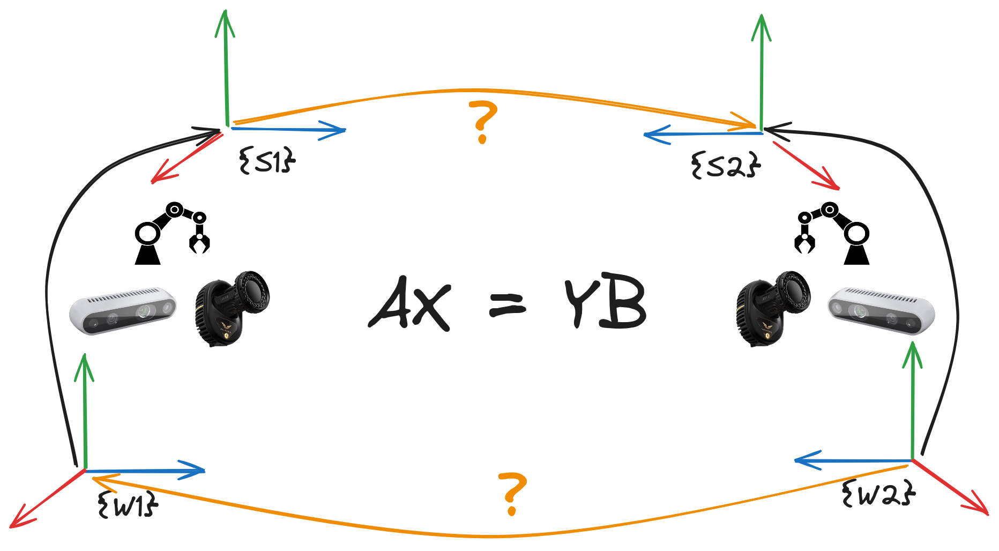

# SimpleHandEye

  

SimpleHandEye is an easy-to-use and hardware-independent Python package for finding the unknown transformation between the world and sensor coordinates of two independent pose tracking systems (e.g. the transformation between the camera and robot gripper or the camera and robot base). 

This tool is meant to be hardware independent, easy to use, and completely Pythonic and feature:

- Classes abstracting OpenCV `AX=YB` and `AX=XB` solvers
- A class for performing nonlinear optimization for minimizing parameters that minimize reprojection error (TODO) 
- Simple Python classes for querying ROS and ROS2 TF messages. 
- Simple Apriltag and Chessboard pose estimation classes.
- Classes for reading images from Intel Realsense (based on pyrealsense2) and UVC USB cameras (TODO)

## Installation
