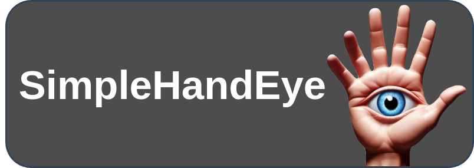
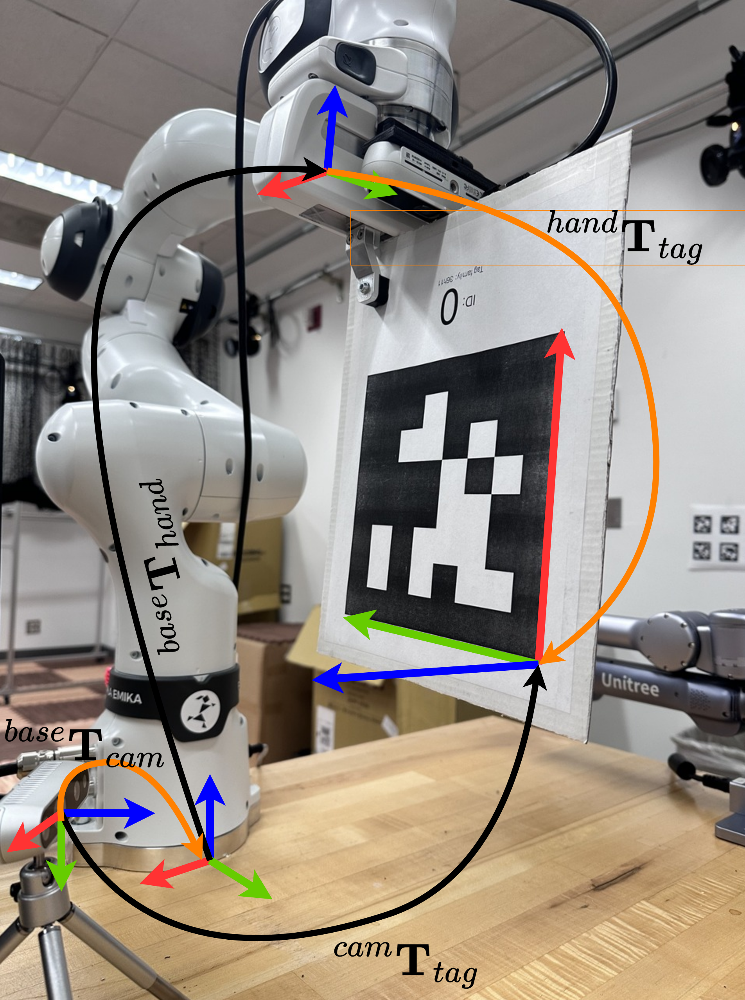
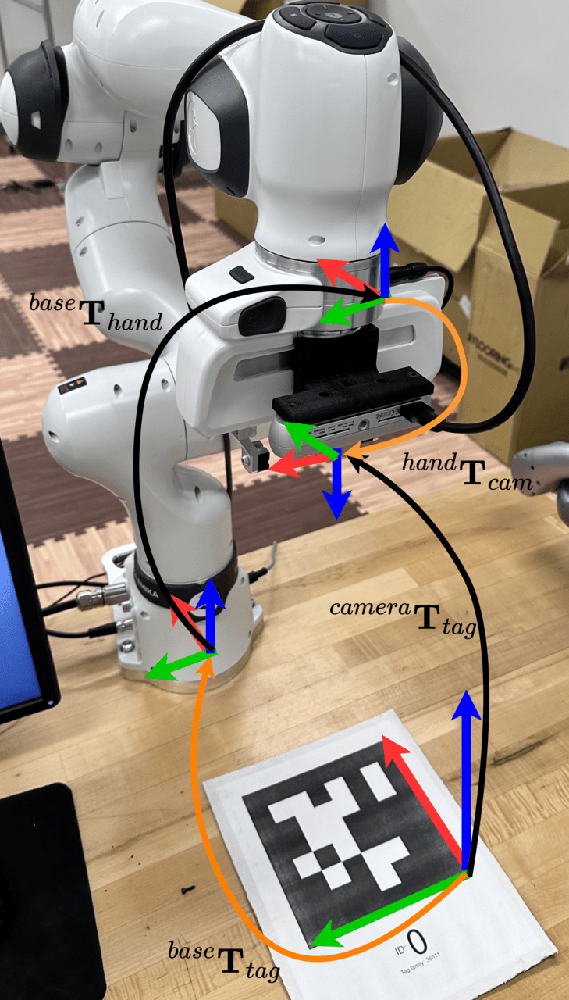
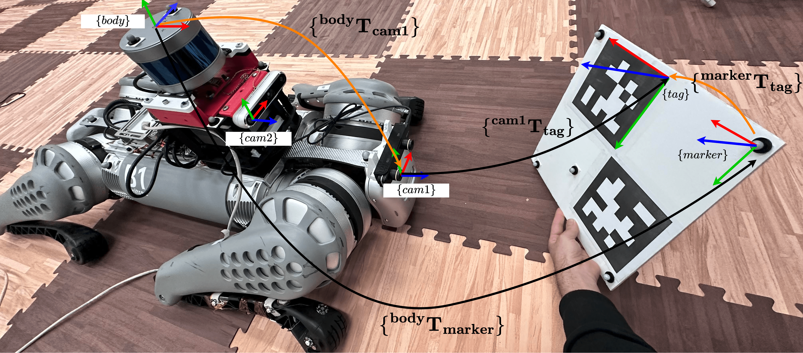

<p align="left">
  
</p>

#
<p align="center">
  
</p>

SimpleHandEye is an easy-to-use and hardware-independent Python package for finding the unknown transformation between the world and sensor coordinates of two independent pose tracking systems (e.g. the transformation between the camera and robot gripper or the camera and robot base). 

This tool is meant to be hardware independent, easy to use, and completely Pythonic and feature:

- Classes abstracting OpenCV `AX=YB` and `AX=XB` solvers
- A class for performing nonlinear optimization for minimizing parameters that minimize reprojection error (TODO) 
- Simple Python classes for querying ROS and ROS2 TF messages. 
- Simple Apriltag and Chessboard pose estimation classes.
- Classes for reading images from Intel Realsense (based on pyrealsense2), UVC USB cameras, and ROS/ROS2 image topics.

## Installation

Simply install through pip (TODO):

```bash
pip install simple-handeye
```

or clone and install as follows:

```bash
git clone https://github.com/Rooholla-KhorramBakht/SimpleHandEye.git
cd SimpleHandEye
pip install -e .
```
## How To Use?

Here, we provide some common applications of this package. However, this package may be used based any kind of pose sensing systems.


### Eye On Base Calibration
The goal in this example is to find the extrinsic transformation between a camera attached to a manipulation table and the base coordinate frame of the robot.

In this example, the first pose tracking system is the end-effector pose computed based on the forward kinematics of the robot which gives the pose of the hand coordinate frame. The other pose sensor is the camera which continuously tracks the pose of an Apriltag/chessboard attached to the end-effector. The overall setup is shown in the following image:
<p align="center">
  
</p>

#### Tracking $\mathbf{{}^{cam}T_{tag}}$ :

In this example, we use a Realsense camera so first we need to instantiate our Realsense camera wrapper class to read images and camera parameters:

```python
from SimpleHandEye.interfaces.cameras import RealSenseCamera
import cv2

def showImage(color_frame, depth_frame, ir1_frame, ir2_frame):
    cv2.imshow('image', color_frame)
    cv2.waitKey(33)

camera = RealSenseCamera(callback_fn=showImage)

intrinsics_params = camera.getIntrinsics()
K = intrinsics_params['RGB']['K']
D = intrinsics_params['RGB']['D']
```

After running above, a new window pops up with a live stream from the camera. We can access to the latest images through:

```python
img = camera.color_frame
```
**Note**: In case the image was available in the form of ROS messages, we could have used our ROS2/ROS image listener classes.

Finally, to track the pose of the tag, we can use our Apriltag tracker class. 

```python
from SimpleHandEye.interfaces.apriltag import ApriltagTracker

tag_pose_tracker = ApriltagTracker(tag_size=0.172, # put your tag size here
                          intrinsic_matrix=K,
                          distortion_coeffs=D)
```

We can query the pose of a tag with arbitrary ID as simply by giving the image from the camera and the requested ID to the `getPose` method of the tracker:

```python
cam_T_tag = tag_pose_tracker.getPose(camera.color_frame, tag_id=0)
```
**Note:** You can also use any ROS-based third-party tracker and listen to the corresponding TF messages.
#### Tracking $\mathbf{{}^{base}T_{hand}}$ :

To get the end-effector pose, we use [FR3Py](https://github.com/Rooholla-KhorramBakht/FR3Py), a Python library for easy interface to Franka FR3 robots. But you can also use other robotic manipulators and subscribe to their ROS TF messages through `SimpleHandEye.interfaces.ros`. 

Follow through the steps in FR3Py documentation to install the library and run the corresponding C++ driver to communicate with the robot. Then instantiate the python interface as follows:

```python
from FR3Py.robot.interface import FR3Real
robot = FR3Real()
```

Then use the the Pinocchio model to compute the end-effector pose:

```python
from FR3Py.robot.model import PinocchioModel

model = PinocchioModel()

def getHandPose():
  state = robot.getStates()
  q, dq = state['q'], state['dq']
  info = model.getInfo(q, dq)
  R, t = info['R_EE'], info['P_EE']

  base_T_hand = np.vstack([np.hstack([R, t.reshape(3,1)]),
                          np.array([0,0,0,1])])
  return base_T_hand

base_T_hand = getHandPose()
```

#### Formulating the Problem and Collecting Data
The kinematic loop in this problem can be written as:

```math
\begin{align*}
&{}^{base}\mathbf{T}_{hand} \times {}^{hand}\mathbf{T}_{tag} \times {}^{tag}\mathbf{T}_{cam} \times {}^{cam}\mathbf{T}_{base} = \mathbf{I}_{4\times4}\\
&{}^{base}\mathbf{T}_{hand} \times {}^{hand}\mathbf{T}_{tag} = {}^{cam}\mathbf{T}_{tag} \times {}^{base}\mathbf{T}_{cam}
\end{algin}
```
If we define:
```math
\begin{align*}
&A = {}^{base}\mathbf{T}_{hand}, \\
&X = {}^{hand}\mathbf{T}_{tag}, \\
&Y = {}^{base}\mathbf{T}_{cam}, \\
&B = {}^{cam}\mathbf{T}_{tag}
\end{algin*}
```
we get the standard $AX=YB$ equation. To identify $X,Y$ we have to collect a dataset of $A,B$ poses in which, we move the end-effector in front of the tag throughout various configurations. To solve the problem, first instantiate the solver:

```python 
from SimpleHandEye.solvers import OpenCVSolver
solver = OpenCVSolver(type='AX=YB)
```

Then you need to provide the sampled poses in the form of two lists. You can use the following Jupyter notebook UI or any tool you want to collect the data and compute the results:

```python
import ipywidgets as widgets
import numpy as np
from IPython.display import display
from pprint import pprint
from IPython.display import clear_output
np.set_printoptions(suppress=True, precision=3)

# The dataset
A_list = []
B_list = []
apriltag_info = []
apriltag_imgs_raw = []
apriltag_imgs_udist = []
def on_sample_clicked(b):
    A  = getHandPose()
    img = camera.color_frame
    info = tag_pose_tracker.getPoseAndCorners(img, tag_id=0)
    B = info['pose']
    apriltag_info.append(info)
    apriltag_imgs_raw.append(img)
    apriltag_imgs_udist.append(tracker.undistortImage(img))
    print("A=")
    pprint(A)
    print("B=")
    pprint(B)
    # if A is not None and B is not None:
    A_list.append(A)
    B_list.append(B)
    print("*************")

def on_compute_clicked(b):
    try:
        X,Y = solver.solve(A_list, B_list)
        clear_output(wait=True)
        print("X=")
        pprint(X)
        print("Y=")
        pprint(Y)
    except:
        print("Bad dataset, please record again")
        A_list.clear()
        B_list.clear()
        

sample_button = widgets.Button(description="Sample")
compute_button = widgets.Button(description="Compute")

sample_button.on_click(on_sample_clicked)
compute_button.on_click(on_compute_clicked)
display(sample_button)
display(compute_button)
```
At the end, the solution is printed out to the output. You can use the helper exporter classes in `SimpleHandEye.exporters` to save the results in various formats.
### Eye On Hand Calibration
The goal in this example is to find the extrinsic transformation between a camera attached to the end-effector and the end-effector coordinate frame.

In this example, the first pose tracking system is the end-effector pose computed based on the forward kinematics of the robot which gives the pose of the hand coordinate frame. The other pose sensor is the camera which continuously tracks the pose of an Apriltag/chessboard rigidly attached to manipulation table. The overall setup is shown in the following image:
<p align="center">
  
</p>

#### Tracking $\mathbf{{}^{cam}T_{tag}}$ :

In this example, we use a Realsense camera so first we need to instantiate our Realsense camera wrapper class to read images and camera parameters:

```python
from SimpleHandEye.interfaces.cameras import RealSenseCamera
import cv2

def showImage(color_frame, depth_frame, ir1_frame, ir2_frame):
    cv2.imshow('image', color_frame)
    cv2.waitKey(33)

camera = RealSenseCamera(callback_fn=showImage)

intrinsics_params = camera.getIntrinsics()
K = intrinsics_params['RGB']['K']
D = intrinsics_params['RGB']['D']
```

After running above, a new window pops up with a live stream from the camera. We can access to the latest images through:

```python
img = camera.color_frame
```
**Note**: In case the image was available in the form of ROS messages, we could have used our ROS2/ROS image listener classes.

Finally, to track the pose of the tag, we can use our Apriltag tracker class. 

```python
from SimpleHandEye.interfaces.apriltag import ApriltagTracker

tag_pose_tracker = ApriltagTracker(tag_size=0.172, # put your tag size here
                          intrinsic_matrix=K,
                          distortion_coeffs=D)
```

We can query the pose of a tag with arbitrary ID as simply by giving the image from the camera and the requested ID to the `getPose` method of the tracker:

```python
cam_T_tag = tag_pose_tracker.getPose(camera.color_frame, tag_id=0)
```
**Note:** You can also use any ROS-based third-party tracker and listen to the corresponding TF messages.
#### Tracking $\mathbf{{}^{base}T_{hand}}$ :

To get the end-effector pose, we use [FR3Py](https://github.com/Rooholla-KhorramBakht/FR3Py), a Python library for easy interface to Franka FR3 robots. But you can also use other robotic manipulators and subscribe to their ROS TF messages through `SimpleHandEye.interfaces.ros`. 

Follow through the steps in FR3Py documentation to install the library and run the corresponding C++ driver to communicate with the robot. Then instantiate the python interface as follows:

```python
from FR3Py.robot.interface import FR3Real
robot = FR3Real()
```

Then use the the Pinocchio model to compute the end-effector pose:

```python
from FR3Py.robot.model import PinocchioModel

model = PinocchioModel()

def getHandPose():
  state = robot.getStates()
  q, dq = state['q'], state['dq']
  info = model.getInfo(q, dq)
  R, t = info['R_EE'], info['P_EE']

  base_T_hand = np.vstack([np.hstack([R, t.reshape(3,1)]),
                          np.array([0,0,0,1])])
  return base_T_hand

base_T_hand = getHandPose()
```

#### Formulating the Problem and Collecting Data
The kinematic look in this problem can be written as:

```math
\begin{align*}
  &{}^{base}\mathbf{T}_{hand} \times {}^{hand}\mathbf{T}_{cam} \times {}^{cam}\mathbf{T}_{tag} \times {}^{tag}\mathbf{T}_{base} = \mathbf{I}_{4\times4}\\
  {}^{base}\mathbf{T}_{hand} \times {}^{hand}\mathbf{T}_{cam} = {}^{base}\mathbf{T}_{tag} \times {}^{tag}\mathbf{T}_{cam}
\end{align}
```

If we define:

```math
\bagin{align*}
  A &= {}^{base}\mathbf{T}_{hand}\\
  X &= {}^{hand}\mathbf{T}_{cam} \\  
  Y &= {}^{base}\mathbf{T}_{tag} \\ 
  B &= {}^{tag}\mathbf{T}_{cam}
\end{align*}
```

 we get the standard $AX=YB$ equation. To identify $X,Y$ we have to collect a dataset of $A,B$ poses in which, we move the end-effector in front of the tag throughout various configurations. To solve the problem, first instantiate the solver:

```python 
from SimpleHandEye.solvers import OpenCVSolver
solver = OpenCVSolver(type='AX=YB)
```

Then you need to provide the sampled poses in the form of two lists. You can use the following Jupyter notebook UI or any tool you want to collect the data and compute the results:

```python
import ipywidgets as widgets
import numpy as np
from IPython.display import display
from pprint import pprint
from IPython.display import clear_output
np.set_printoptions(suppress=True, precision=3)

# The dataset
A_list = []
B_list = []
apriltag_info = []
apriltag_imgs_raw = []
apriltag_imgs_udist = []
def on_sample_clicked(b):
    A  = getHandPose()
    img = camera.color_frame
    info = tag_pose_tracker.getPoseAndCorners(img, tag_id=0)
    B = np.linalg.inv(info['pose']) # Note that B is tag_T_cam
    apriltag_info.append(info)
    apriltag_imgs_raw.append(img)
    apriltag_imgs_udist.append(tracker.undistortImage(img))
    print("A=")
    pprint(A)
    print("B=")
    pprint(B)
    # if A is not None and B is not None:
    A_list.append(A)
    B_list.append(B)
    print("*************")

def on_compute_clicked(b):
    try:
        X,Y = solver.solve(A_list, B_list)
        clear_output(wait=True)
        print("X=")
        pprint(X)
        print("Y=")
        pprint(Y)
    except:
        print("Bad dataset, please record again")
        A_list.clear()
        B_list.clear()
        

sample_button = widgets.Button(description="Sample")
compute_button = widgets.Button(description="Compute")

sample_button.on_click(on_sample_clicked)
compute_button.on_click(on_compute_clicked)
display(sample_button)
display(compute_button)
```
At the end, the solution is printed out to the output. You can use the helper exporter classes in `SimpleHandEye.exporters` to save the results in various formats.

### Vicon Marker to Object Extrinsic Calibration
TODO

### Vicon-Based Multi-Camera Extrinsic Calibration
The goal in this example is to find the extrinsic transformation between cameras installed on a robot/autonomous vehicle and the body coordinate frame (or any common coordinate frame). 

In this example, the first pose tracking system is the Vicon which tracks the pose of markers corresponding to the body frame and markers that are installed on an Apriltag board. The other pose sensor is the cameras of interest which continuously track the pose of an Apriltag/chessboard. The overall setup is shown in the following image:
<p align="center">
  
</p>

#### Tracking $\mathbf{{}^{body}T_{marker}}$ :
To track the relative pose between the marker frame installed on the board and the body frame installed on the robot, we use the ROS2/ROS1 interface to read the TF messages published by vicon-bridge node running in a separate terminal. Instantiate the pose listener as follows:

**For ROS2:**
```python
from SimpleHandEye.interfaces.utils import addFoxyPath
addFoxyPath('/opt/ros/foxy')
from SimpleHandEye.interfaces.ros2 import ROS2TFInterface
import rclpy

rclpy.init()    
marker_pose_listener = ROS2TFInterface('vicon/body', 'vicon/marker')
```
**For ROS:**

```python
from SimpleHandEye.interfaces.utils import addNoeticPath
addNoeticPath('/opt/ros/noetic')
from SimpleHandEye.interfaces.ros import ROSTFInterface, initRosNode

initRosNode()
marker_pose_listener = ROSTFInterface('vicon/body', 'vicon/marker')
```

Test the interface and maker sure you can read the pose from Vicon:

```python
body_T_marker = marker_pose_listener.getPose()
```
#### Tracking $\mathbf{{}^{cam1}T_{tag}}$ :

In this example, we use a Realsense camera so first we need to instantiate our Realsense camera wrapper class to read images and camera parameters:

```python
from SimpleHandEye.interfaces.cameras import RealSenseCamera
import cv2

def showImage(color_frame, depth_frame, ir1_frame, ir2_frame):
    cv2.imshow('image', color_frame)
    cv2.waitKey(33)

camera = RealSenseCamera(callback_fn=showImage)

intrinsics_params = camera.getIntrinsics()
K = intrinsics_params['RGB']['K']
D = intrinsics_params['RGB']['D']
```

After running above, a new window pops up with a live stream from the camera. We can access to the latest images through:

```python
img = camera.color_frame
```
**Note**: In case the image was available in the form of ROS messages, we could have used our ROS2/ROS image listener classes.

Finally, to track the pose of the tag, we can use our Apriltag tracker class. 

```python
from SimpleHandEye.interfaces.apriltag import ApriltagTracker

tag_pose_tracker = ApriltagTracker(tag_size=0.172, # put your tag size here
                          intrinsic_matrix=K,
                          distortion_coeffs=D)
```

We can query the pose of a tag with arbitrary ID as simply by giving the image from the camera and the requested ID to the `getPose` method of the tracker:

```python
cam_T_tag = tag_pose_tracker.getPose(camera.color_frame, tag_id=0)
```
**Note:** We also could have listened to TF messages published by any kind of third-party trackers through ROS. 
#### Formulating the Problem and Collecting Data
The kinematic look in this problem can be written as:
```math
\begin{align*}
{}^{body}\mathbf{T}_{marker} \times {}^{marker}\mathbf{T}_{tag} &\times {}^{tag}\mathbf{T}_{camera} \times {}^{camera}\mathbf{T}_{body} = \mathbf{I}_{4\times4} \\
{}^{body}\mathbf{T}_{marker} \times {}^{marker}\mathbf{T}_{tag} &= {}^{body}\mathbf{T}_{camera} \times {}^{camera}\mathbf{T}_{tag}
\end{align*}
```
If we define:
```math
\begin{align*}
  A &= {}^{body}\mathbf{T}_{marker}\\
  X &={}^{marker}\mathbf{T}_{tag}\\
  Y &= {}^{body}\mathbf{T}_{camera}\\
  B &= {}^{camera}\mathbf{T}_{tag}
\end{align*}
```
we get the standard $AX=YB$ equation. To identify $X,Y$ we have to collect a dataset of $A,B$ poses in which, we move the board in front of the camera throughout various configurations. To solve the problem, first instantiate the solver:

```python 
from SimpleHandEye.solvers import OpenCVSolver
solver = OpenCVSolver(type='AX=YB)
```

Then you need to provide the sampled poses in the form of two lists. You can use the following Jupyter notebook UI or any tool you want to collect the data and compute the results:

```python
import ipywidgets as widgets
import numpy as np
from IPython.display import display
from pprint import pprint
from IPython.display import clear_output
np.set_printoptions(suppress=True, precision=3)

# The dataset
A_list = []
B_list = []
apriltag_info = []
apriltag_imgs_raw = []
apriltag_imgs_udist = []
def on_sample_clicked(b):
    A = marker_pose_listener.getPose()
    img = camera.color_frame
    info = tag_pose_tracker.getPoseAndCorners(img, tag_id=0)
    B = info['pose']
    apriltag_info.append(info)
    apriltag_imgs_raw.append(img)
    apriltag_imgs_udist.append(tracker.undistortImage(img))
    print("A=")
    pprint(A)
    print("B=")
    pprint(B)
    # if A is not None and B is not None:
    A_list.append(A)
    B_list.append(B)
    print("*************")

def on_compute_clicked(b):
    try:
        X,Y = solver.solve(A_list, B_list)
        clear_output(wait=True)
        print("X=")
        pprint(X)
        print("Y=")
        pprint(Y)
    except:
        print("Bad dataset, please record again")
        A_list.clear()
        B_list.clear()
        

sample_button = widgets.Button(description="Sample")
compute_button = widgets.Button(description="Compute")

sample_button.on_click(on_sample_clicked)
compute_button.on_click(on_compute_clicked)
display(sample_button)
display(compute_button)
```
At the end, the solution is printed out to the output. You can use the helper exporter classes in `SimpleHandEye.exporters` to save the results in various formats (TODO: YAML, ROS2, and pickle output formats to be added)
